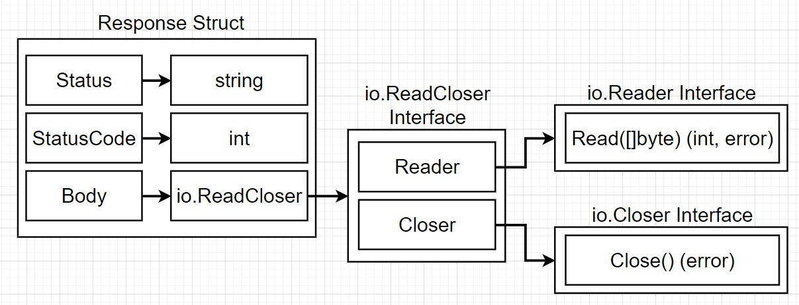
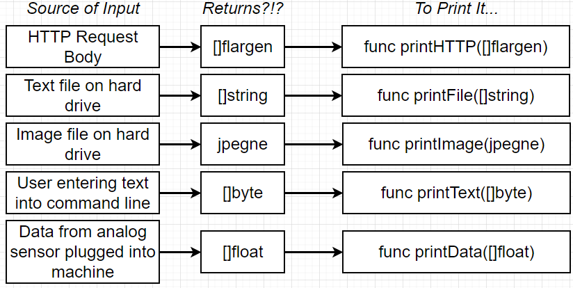
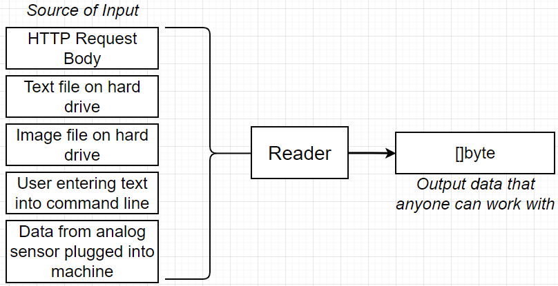
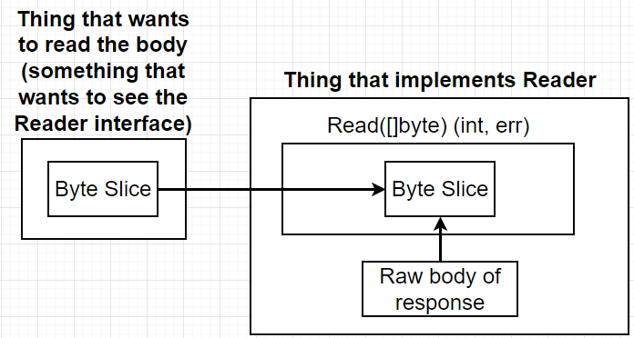
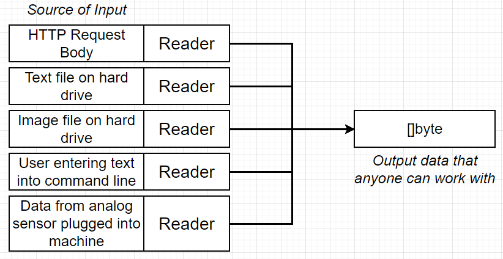
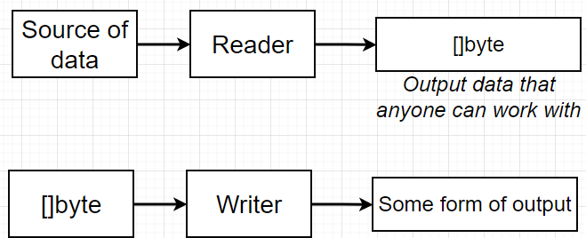
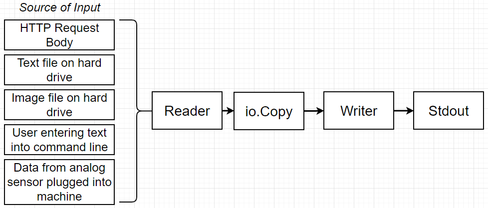
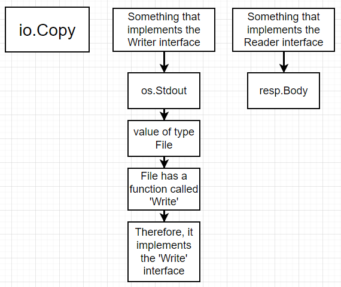

## HTTP Package

- HTTP request to google.com
- Print response to terminal



## Get Response

- `func Get(url string) (resp *Response, err error)`
- `resp, err := http.Get("http://example.com/")`

## Reader Interface

- A **common point of contact** for the multiple sources of input coming into the application.
- So many functions but they all just mean printing the source of input with differnt data types.

 





## Read Function


```
func main() {
	resp, err := http.Get("https://www.google.com")

	// error handling
	if err != nil {
		fmt.Println("Error: ", err)
		os.Exit(1)
	}

	// takes a type of slice, and number of elements that the slice can contain
	bs := make([]byte, 99999)
	resp.Body.Read(bs)
	fmt.Println(string(bs))
}
```

## Writer Interface




```
type Writer interface {
	Write(p []byte) (n int, err error)
}
```

## Copy Function

`func Copy(dst Writer, src Reader) (written int64, err error)`

- `dst Writer`: taking data and send outside the application
- `src Reader`: implement the Reader interface

- Simpler one-line method of logging out the HTML response.
  `io.Copy(os.Stdout, resp.Body)`



## Quiz

1. When we say that interfaces can be satisfied implicitly, we mean that ... We don't have to write any extra code to say that some type satisfies an interface.

2. To say that a type satisfies an interface means that ... The type implements all of the functions contains in the interface definition.

3. In the following code, does the `square` type satisfy the `shape` interface?
```
type shape interface {
    area() int
}
 
type square struct {
    sideLength int
}
 
func (s square) area() int {
    return s.sideLength * s.sideLength
}
 
func printArea(s shape) {
    fmt.Println(s.area())
}
```
- Yes, because `square` defines the `area` function that returns an int.

4. Take a look at the following code. Does the `rectangle` type satisfy the `shape` interface?
```
type shape interface {
    area() int
}
 
type square struct {
    sideLength int
}
 
type rectangle struct {
    height float64
    width float64
}
 
func (s square) area() int {
    return s.sideLength * s.sideLength
}
 
func (r rectangle) area() float64 {
    return r.height * r.width
}
 
func printArea(s shape) {
    fmt.Println(s.area())
}
```
- No, because `rectangle`'s version of the `area` function returns a float64, but the `shape` interface expects a return type of `int`.

5. Take a look at the following code.  Type `square` appears to successfully implement the `shape` interface, but the implementation of `square`'s `area` function looks broken - it always returns a value of 10 no matter what the side length of the square is.  Will the `shape` interface do anything to help us catch this error?
```
type shape interface {
    area() int
}
 
type square struct {
    sideLength int
}
 
func (s square) area() int {
    return 10
}
 
func printArea(s shape) {
    fmt.Println(s.area())
}
```
- No, interfaces are only used to help with types. We can still easily write code that does something completely wrong.

6. Types that implement the Reader interface are generally used to ... Read information from an outside data source into our application.

7. Imagine that you ask a coworker to create a new type that implements the Reader  interface to take data from a text file and print it on the screen.  They present you with the following code:
```
type textFileReader struct {}
 
func (textFileReader) Read(bs []byte) (int, error) {
    return "Information from a text file"
}
```
They say that this code successfully compiled, so it must be correct. You then review their code and give them feedback.  What would you say?
- I would say that while the `textFileReader` type conforms to the requirements of the `Reader` interface, it doesn't actually implement the desired behavior of reading a file from the hard drive.

8. Because interfaces are satisfied implicitly, it can be tough to figure out which types satisfy which interfaces.  

Take a look at the type File inside the os package here: https://golang.org/pkg/os/#File

Does the File type satisfy both the Reader and Writer interfaces? Yes

9. 