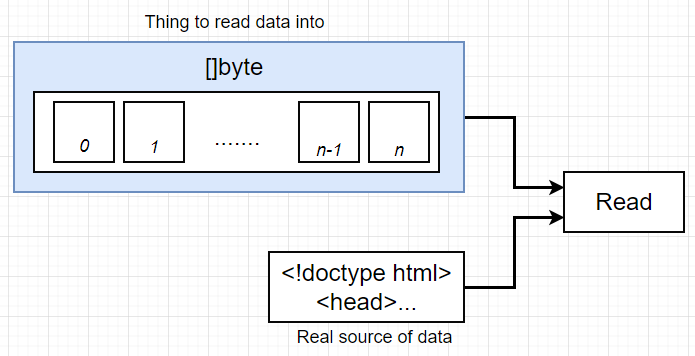

## HTTP Package

- HTTP request to google.com
- Print response to terminal


## GET Response

- `func Get(url string) (resp *Response, err error)`
- `resp, err := http.Get("http://example.com/")`

## Reader Interface

- A **common point of contact** for the multiple sources of input coming into the application.
- So many functions but they all just mean printing the source of input with differnt data types.


## Read Function



```
func main() {
	resp, err := http.Get("https://www.google.com")

	// error handling
	if err != nil {
		fmt.Println("Error: ", err)
		os.Exit(1)
	}

	// takes a type of slice, and number of elements that the slice can contain
	bs := make([]byte, 99999)
	resp.Body.Read(bs)
	fmt.Println(string(bs))
}
```

## Writer Interface


```
type Writer interface {
	Write(p []byte) (n int, err error)
}
```

## Copy Function

`func Copy(dst Writer, src Reader) (written int64, err error)`

- `dst Writer`: taking data and send outside the application
- `src Reader`: implement the Reader interface

- Simpler one-line method of logging out the HTML response.
  `io.Copy(os.Stdout, resp.Body)`


