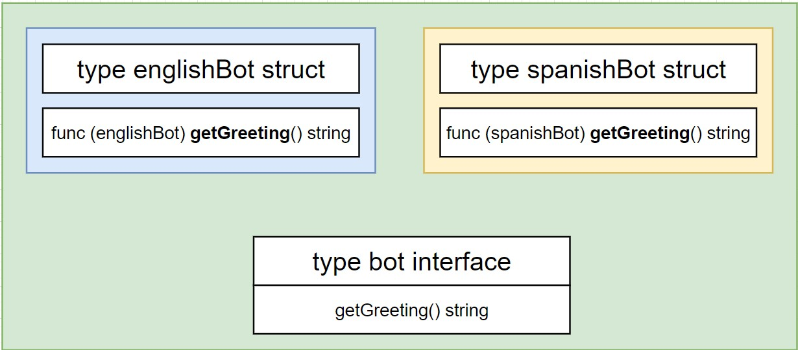
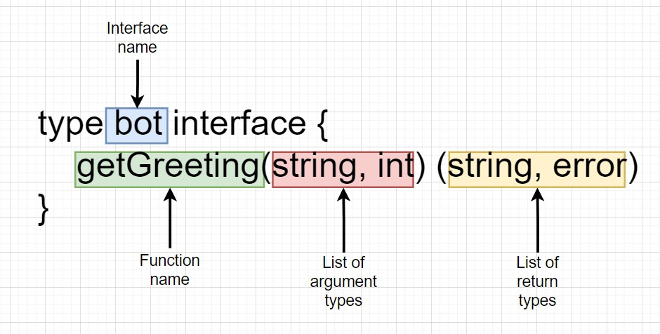

## type interface

- create a new type called 'bot'
- `getGreeting()`: if there is another function that consists of `getGreeting()` and returns type string, then it is a 'bot'.
- They are now of type 'bot'

```
type bot interface {
	getGreeting() string
}
```




## Concrete Type vs Interface Type

|             Concrete Type              |         Interface Type          |
| :------------------------------------: | :-----------------------------: |
| `map, struct, int, string, englishBot` |              `bot`              |
|      can create a value directly.      | cannot create a value directly. |

## Extra Interface Notes

|                        Notes                        |                                                        Description                                                        |
| :-------------------------------------------------: | :-----------------------------------------------------------------------------------------------------------------------: |
|        Interfaces are **not** generic types         |                              Other languages have 'generic' types - go (famously) does not.                               |
|              Interfaces are 'implicit'              |                       We don't manually have to say that our custom type satisfies some interface.                        |
| Interfaces are a contract to help us manage types.  |             If our custom type's implementation of a function is broken, <br> then interfaces won't help us!              |
| Interfaces are tough. Learn how to understand them. | Understand how to read interfaces in the standard lib. <br> Writing your own interfaces is tough and requires experience. |
